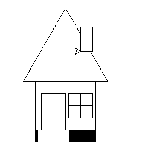
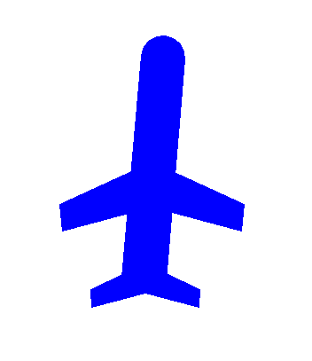
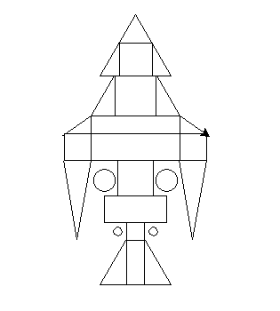
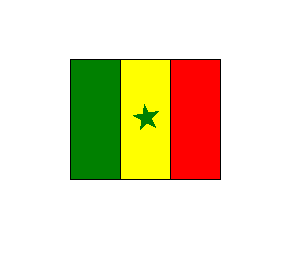

# PRESENTATION, DESSINS ET TABLEAUX DE FLUX

## Présentation 
Ce Projet été réalise par les 3 étudiants suivants :  

° **Papa Ba GAYE** a écrit le module **dessinMSDA.py** et les **commentaires de spécification** et le **README avec le Tableau de flux**  
° **Kardiatou GAKO** a écrit le fichier **fusee.py** et le fichier **maison.py**  
° **Aphsatou DIA** a écrit le fichier **avion.py** et le fichier **test.py**  
° Et nous avons travaillé ensemble sur le **Drapeau** (**figure au choix**)

 

nb : **Les commentaires de spécifications sont a l'intérieur de chaque fonction du module dessinMSDA.py**

## Tableaux de flux et Dessins 

  <h3>Maison</h3>
  <table class="table table-dark">
    <thead class="">
      <tr>
        <th>Maison</th>
        <th>Fournit (Entrées)</th>
        <th>Reçoit (Sorties)</th>
      </tr>
    </thead>
    <tbody>
      <tr>
        <td>Rectangle</td>
        <td>longueur, largeur, couleur, couleur2</td>
        <td> - </td>
      </tr>
      <tr>
        <td>carrée</td>
        <td>Coté, couleur</td>
        <td> - </td>
      </tr>
      <tr>
        <td>triangle</td>
        <td>Coté, couleur</td>
        <td> - </td>
      </tr>
    </tbody>
  </table>

  

  <h3>Avion</h3>
  <table class="table table-dark">
    <thead class="">
      <tr>
        <th>Avion</th>
        <th>Fournit (Entrées)</th>
        <th>Reçoit (Sorties)</th>
      </tr>
    </thead>
    <tbody>
      <tr>
        <td>Rectangle</td>
        <td>longueur, largeur, couleur, couleur2</td>
        <td> - </td>
      </tr>
      <tr>
        <td>Trapèze</td>
        <td>cote1, cote2, cote3, cote4, couleur, couleur2</td>
        <td> - </td>
      </tr>
      <tr>
        <td>cercle</td>
        <td>rayon, couleur, couleur2</td>
        <td> - </td>
      </tr>
    </tbody>
  </table>

  

  <h3>Fusée</h3>
  <table class="table table-dark">
    <thead class="">
      <tr>
        <th>Fusée</th>
        <th>Fournit (Entrées)</th>
        <th>Reçoit (Sorties)</th>
      </tr>
    </thead>
    <tbody>
      <tr>
        <td>triangle</td>
        <td>Coté, couleur</td>
        <td> - </td>
      </tr>
      <tr>
        <td>Rectangle</td>
        <td>longueur, largeur, couleur, couleur2</td>
        <td> - </td>
      </tr>
      <tr>
        <td>Carre</td>
        <td>cote, couleur</td>
        <td> - </td>
      </tr>
      <tr>
        <td>cercle</td>
        <td>rayon, couleur, couleur2</td>
        <td> - </td>
      </tr>
    </tbody>
  </table>

  

  <h3>Drapeau</h3>
  <table class="table table-dark">
    <thead class="">
      <tr>
        <th>Drapeau</th>
        <th>Fournit (Entrées)</th>
        <th>Reçoit (Sorties)</th>
      </tr>
    </thead>
    <tbody>
      <tr>
        <td>Rectangle</td>
        <td>longueur, largeur, couleur, couleur2</td>
        <td> - </td>
      </tr>
    </tbody>
  </table>
  

**Participants**
<ul>
    <li><a href="https://github.com/PapaBaGAYE">Papa Ba GAYE</a></li>
    <li><a href="https://github.com/kardiatougako">Kardiatou GAKO</a></li>
    <li><a href="https://github.com/Diaaphsatou">Aphsatou DIA</a></li>
</ul>